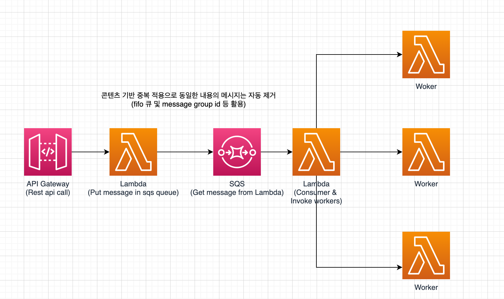

# AWS SQS With Lambda

notification 서버 구축을 위한 Poc

## TODO

1. serverless를 통해 sqs 관련 리소스(람다, sqs) 배포 가능한 템플릿 작성 및 배포
2. poc차원에서 간단한 rest api 호출을 통한 sqs fifo 큐에 메시지 넣기
3. sqs는 대기열 큐에 있는 메시지를 람다로 전송
4. 람다는 다음과 같은 람다를 작성
   1. 문자 메시지 전송 람다
   2. 이메일 전송 람다
   3. 소셜 계정 서비스 람다
   4. 전화 보이스콜 람다
   
## 설계 고려 사항

- 여러 람다가 추가될 수 있음을 고려
- 콘텐츠 기반 중복 제거를 통해(fifo 큐 및 message group id 혹은 duplicated message id 등
  ) 중복된 메시지를 람다에 전달하지 않도록 강제
   - 위 기능은 5분의 인터벌 동안 동일한 메시지가 들어오면 모두 제거합니다.
   
## 아키텍쳐



## Servelress 템플릿

```yml
service: sqs-poc

provider:
  name: aws
  runtime: python3.7
  stage: dev
  iamRoleStatements:
    - Effect: "Allow"
      Action:
        - "logs:*"
        - "sqs:*"
        - "lambda:*"
        - "sns:*"
      Resource: "*"
  environment:
    QUEUE_URL: !Ref PocQueue
    QUEUE_NAME: { Fn::GetAtt: [PocQueue, QueueName] }

functions:
  producer:
    handler: producer.handler
    events:
      - http:
          method: post
          path: send
  consumer:
    handler: consumer.handler
    events:
      - sqs:
          arn: { Fn::GetAtt: [PocQueue, Arn] }

resources:
  Resources:
    PocQueue:
      Type: "AWS::SQS::Queue"
      Properties:
        QueueName: "PocQueue.fifo"
        FifoQueue: "true"
        ContentBasedDeduplication: "true"
  Outputs:
    pocQueueArn:
      Value: { Fn::GetAtt: [PocQueue, Arn] }
      Export:
        Name: pocQueueArn
    pocQueueName:
      Value: { Fn::GetAtt: [PocQueue, QueueName] }
      Export:
        Name: pocQueueName
    pocQueueUrl:
      Value: !Ref PocQueue
      Export:
        Name: PocQueueUrl

```

## 테스트 방법

`git clone https://github.com/kimsehwan96/aws-sqs-with-serverless.git`

`cd aws-sqs-with-serverless`
`notifications.py 파일의 다음 내용 수정`

```python3
import boto3
import json
from notification_base import BaseNotification


class SMS(BaseNotification):
    def __init__(self, message):
        super().__init__()
        self.message = message
        print('this is sending message :', self.message)
        self.client = boto3.client('sns', region_name='ap-northeast-1')

    def send(self):
        res = self.client.publish(
            PhoneNumber="+8201042707227",
            Message=str(self.message)
        )
        return json.dumps(res)

```

`PhoneNumber 부분을 자신의 전화번호로 수정`

` sls deploy --stage dev --region ap-northeast-2`

위 명령어를 통해 배포

이후 생성된 API Gateway 엔드포인트로 `Post` 메서드를 이용, Body에 Rawmessage로 문자열을 입력하고 전송하면
문자메시지 전달 받음. 중복된 컨텐츠는 전달 받지 않음
